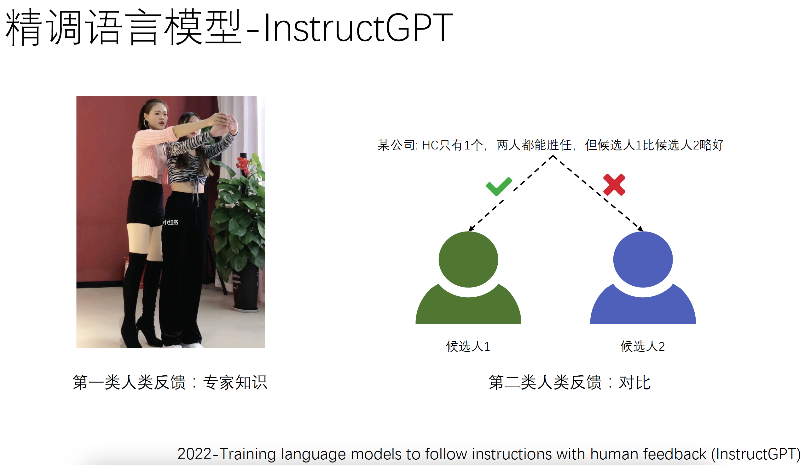
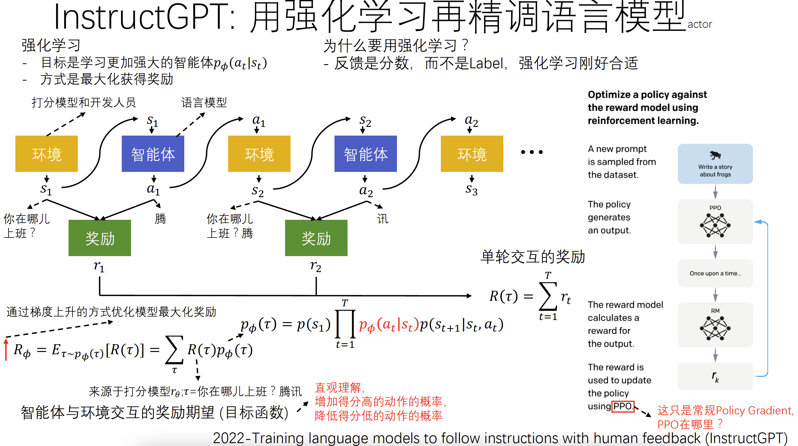

# ChatGPT-Techniques-Introduction-for-Everyone
面向非专业人士的ChatGPT技术介绍：
1. 非自然语言处理（NLP）领域的同学，可以放心跳过其中复杂的部分，不会错过对关键概念的理解。
2. 非大语言模型（LLM）领域的同学，可以通过其中关键技术的详细拆解，理解其中核心技术的原理。

## 资料 
- [ChatGPT-从语言知识到知识库-all](./docs/ChatGPT-从语言知识到知识库-all.pdf)

## 示例
- 人类反馈类型

- 适用强化学习技术利用人类反馈

